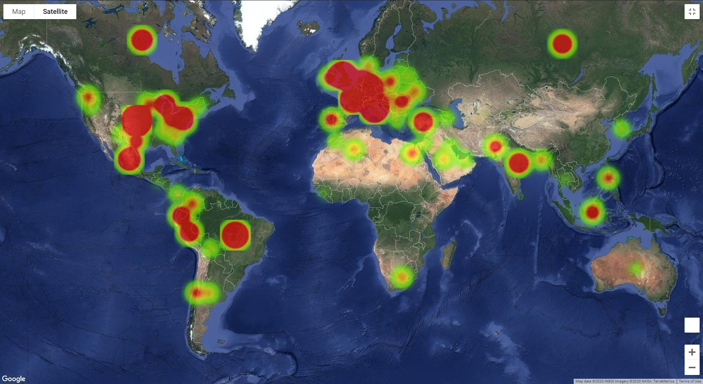

# COVID19 Data Visualization and Analysis

### Image of Jupyter Gmaps Global COVID-19 Deaths 6/2/2020

This repository is a work in progress showing multiple ways to analyze and visualize the COVID-19 pandemic, both in the USA and Worldwide. Using the Microsoft Bing COVID-19 Tracker, we can create visualization and analysis using three different methods. Ultimately, each method will be reviewed and scored in a series of Blog posts on Medium to showcase the benefits and disadvantages of each approach.

Data Source: Microsoft Bing COVID-19 Tracker https://www.bing.com/covid.
Downloadable CSV Data is available here: https://github.com/microsoft/Bing-COVID-19-Data

The three methods used will be:

- Python with Jupyter Notebooks, Matplotlib, and gmaps for interactive heatmapping (See file: covid_analysis.ipynb)
- Tableau to create interactive maps and dashboards (link below)
- React application using D3 (or Plotly), Mapbox, with back-end powered by Flask and querying with GraphQL (coming soon!)

Tableau Public Workbook: https://public.tableau.com/profile/stephen.marshall5738#!/vizhome/COVID-19InteractiveDataVisualizationandMapping/COVID19-MicrosoftBingTracker

Additionally, to prove my abilities using SQL and PostgreSQL with Amazon Redshift, I've also included a SQL directory showing a query that powers one of my company FareHarbor's dashboards for the onboarding team. This query is not related to the COVID dataset, which was available as a downloadable CSV so no SQL was necessary, or rather it was more efficient to pull this directly in a Pandas Dataframe.
